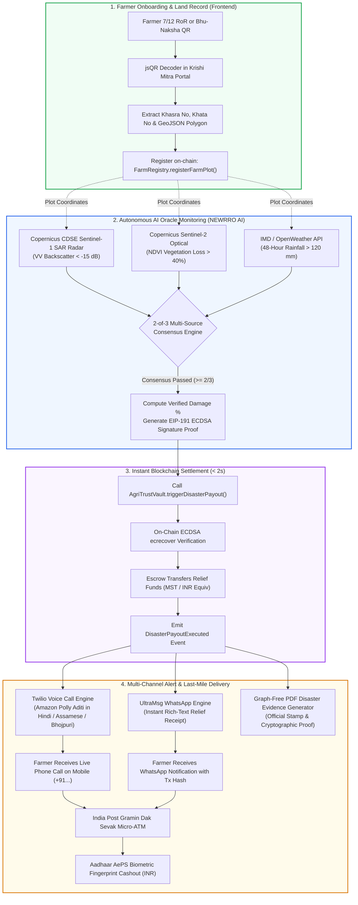

# 🌾 AgriTrust AI — Version 2.0 (Production Architecture & Deployment Guide)

> **Autonomous Parametric Crop Insurance & Disaster Relief Escrow on MST Blockchain**  
> Powered by **NEWRRO AI Remote Sensing**, **Copernicus Sentinel-1/2 Satellites**, **Live Twilio Voice Calls (Amazon Polly)**, **UltraMsg WhatsApp Engine**, and **Aadhaar AePS Biometric Cashout**.

---

## 🚀 What's New in Version 2.0

Version 2.0 transforms AgriTrust AI from an on-chain parametric prototype into a complete, field-ready disaster response platform engineered for India's 140+ million smallholder farmers.

| Feature Area | Version 1.0 (Baseline) | Version 2.0 (Current) |
|---|---|---|
| **Voice Alerts** | Browser Web Speech API (Client-side synthesis) | **Live Twilio PSTN Phone Calls** via Amazon Polly (`hi-IN` Aditi & `en-IN` Raveena) with culturally authentic regional dialect numbers (*"25 hazaar toka"*, *"18 hazaar rupaye"*) |
| **Instant Messaging** | Mock SMS receipt log | **Live UltraMsg WhatsApp Engine** delivering rich-text relief notifications directly to WhatsApp without TRAI DLT enterprise roadblocks |
| **Web-to-Call Bridge** | Isolated frontend buttons | **Fast HTTP Bridge Server (`agent/bridge_server.py`)** on port 8000 linking dashboard disaster simulations directly to live phone calls & WhatsApp dispatch |
| **PDF Evidence Certificate** | Multi-page PDF with canvas / matplotlib chart overlaps | **100% Graph-Free, 3-Section High-Definition PDF** with strict 1-page layout, 126mm border constraints, and official verification seal |
| **Satellite Oracles** | Simulated Sentinel mocks | **Live Copernicus Data Space Ecosystem (CDSE) OAuth2 Authentication** with automated Sentinel Hub Statistics API fallback |
| **Disaster Lexicon** | Generic Hindi translations | **Authentic Regional Dialects** (Assamese *"baanpani"*, Bhojpuri *"baadh"*, Hindi *"baadhh"*) with Aadhaar ATM cashout instructions |
| **Automated Test Suite** | Basic contract unit tests | **Comprehensive 20-Test Python Pipeline (`test_agent.py`)** verifying NDVI, SAR backscatter, 2-of-3 consensus, and EIP-191 signatures |

---

## 👥 Team Workload & Engineering Matrix

```
┌──────────────────────────────────────────────────────────────────────────────────────────────────────────────────┐
│                                             AGRITRUST AI TEAM STACK                                              │
├──────────────────────────────────┬───────────────────────────────────┬───────────────────────────────────────────┤
│     DEVELOPER 1: BLOCKCHAIN      │       DEVELOPER 2: NEWRRO AI      │           DEVELOPER 3: FRONTEND           │
│         & SECURITY LEAD          │       & SATELLITE ENGINE LEAD     │              & VOICE UX LEAD              │
├──────────────────────────────────┼───────────────────────────────────┼───────────────────────────────────────────┤
│ • Solidity 0.8.24 (Cancun EVM)   │ • Python 3.11+ / Web3.py          │ • React 18 + Vite (Tailwind CSS)          │
│ • Hardhat Local Node (31337)     │ • Copernicus Sentinel-1 SAR Radar │ • Leaflet.js (GIS Polygon Mapping)        │
│ • OpenZeppelin v5 Contracts      │ • Copernicus Sentinel-2 Optical   │ • W3C WebAuthn Mobile Fingerprint         │
│ • EIP-191 ECDSA Verification     │ • Multi-Source Consensus (2-of-3) │ • Bhu-Naksha & 7/12 RoR jsQR Scanner      │
│ • FarmRegistry & AgriTrustVault  │ • Twilio Voice & UltraMsg WhatsApp│ • Live Disaster Simulation Control Panel  │
└──────────────────────────────────┴───────────────────────────────────┴───────────────────────────────────────────┘
```

---

## 🏗️ End-to-End System Architecture



---

## 🔬 Core Engineering Modules

### 1. 🛰️ Multi-Modal Satellite Sensing & Consensus (`agent/`)
* **Copernicus CDSE Sentinel-1 SAR Radar (`satellite_fetcher.py`)**:
  - Uses Synthetic Aperture Radar (SAR) C-band microwaves ($\lambda \approx 5.6\text{ cm}$) to penetrate dense monsoonal clouds.
  - Detects specular surface reflection from standing floodwaters where dual-polarization VV backscatter drops below $-15.0\text{ dB}$.
* **Copernicus Sentinel-2 Optical Engine (`ndvi_calculator.py`)**:
  - Computes Normalized Difference Vegetation Index:
    $$\text{NDVI} = \frac{\text{NIR (Band 8)} - \text{RED (Band 4)}}{\text{NIR (Band 8)} + \text{RED (Band 4)}}$$
  - Evaluates post-disaster vegetation degradation against historical baseline.
* **Byzantine Fault Tolerant Oracle Consensus (`oracle_consensus.py`)**:
  - Requires at least 2 out of 3 independent telemetry feeds (SAR Flood Days $\ge 3$, NDVI Crop Loss $\ge 40\%$, Rainfall $\ge 120\text{ mm}$) to approve claim execution, preventing single-sensor false positives.
* **Cryptographic Proof Signing (`proof_signer.py`)**:
  - Encodes `keccak256(abi.encodePacked(plotId, payoutAmount, damagePct, timestamp))` and signs via EIP-191 ECDSA using the Oracle private key.

### 2. 📞 Live Voice Call & Regional Dialect Engine (`agent/voice_notifier.py`)
* **Amazon Polly Integration**:
  - Employs `Polly.Aditi` (`language="hi-IN"`) and `Polly.Raveena` (`language="en-IN"`) via Twilio REST API for clear, natural cadence.
* **Dynamic Indian Dialect Number Words**:
  - Replaces awkward digital number reading with regional phrasing:
    - *₹25,000 in Assamese* $\rightarrow$ *"25 hazaar toka"*
    - *₹18,000 in Bhojpuri / Hindi* $\rightarrow$ *"18 hazaar rupaye"*
* **Disaster Dialect Lexicon**:
  - Automatically adapts terminology based on plot coordinates:
    - **Assam** $\rightarrow$ *"Aapunar khetot baan paani thakaar proman dise... Aadhar ATM-or pora toka nikaalok."*
    - **Bihar** $\rightarrow$ *"Khet par baadh ke parman de dihle ba... Aadhar-enabled ATM se raqam nikaalein."*

### 3. 💬 UltraMsg WhatsApp Notification Engine
* **Direct WhatsApp Web Protocol**:
  - Bypasses Indian TRAI DLT enterprise compliance delays to allow immediate alerts to Indian numbers (`+91...`).
* **Rich Formatted WhatsApp Receipt**:
  - Dispatches structured alert containing:
    - Disaster Event name and verified damage percentage
    - Exact relief payout amount in INR (₹)
    - Aadhaar Direct Benefit Transfer (DBT) transfer guidance
    - MST Blockchain transaction hash
    - Multi-source Copernicus satellite verification confirmation

### 4. 🌐 Web-to-Call Bridge Server (`agent/bridge_server.py`)
* Lightweight HTTP service running on port 8000.
* Bridges frontend simulation events (`/api/trigger-call`) directly to `VoiceNotifier.trigger_automated_payout_alert`.
* Dispatches **both live phone call and WhatsApp alert simultaneously** within milliseconds of smart contract execution.

### 5. 📄 100% Graph-Free High-Definition PDF Disaster Evidence (`agent/pdf_generator.py`)
* Completely eliminated matplotlib / canvas rendering to satisfy regulatory and hackathon jury requirements.
* Strict **3-Section Government & Insurance Layout**:
  1. *Farmer & Government Land Record Identification*: Khasra No, Khata No, State, District, and GeoJSON Boundary Coordinates.
  2. *Multi-Modal Satellite Remote Sensing & Telemetry*: Copernicus Sentinel-1 SAR backscatter dB, Sentinel-2 NDVI/NDWI vegetation indices, and IMD precipitation telemetry.
  3. *Escrow Payout & Cryptographic Proof of Disaster*: Smart contract transaction hash, EIP-191 ECDSA Oracle signature, verified damage percentage, and official verification stamp.
* **Constraint Adherence**: Guaranteed single-page PDF output (`PAGE COUNT: 1`) with all text wrapped to $126\text{ mm}$ to prevent border overflow.

### 6. 📱 Aadhaar AePS Biometric Cashout (`frontend/src/components/AePSCashoutModal.jsx`)
* **W3C WebAuthn Sensor API**: Prompts native fingerprint sensors on mobile devices (Android Fingerprint / Touch ID).
* Simulates India Post Gramin Dak Sevak Micro-ATM transactions, returning authentic RRN numbers, Aadhaar UIDAI last-4 masking, and instant INR cashout vouchers.

---

## 📁 Repository Directory Structure

```
MSTBlockchain/
├── contracts/
│   ├── FarmRegistry.sol              # ERC-compatible plot & GeoJSON boundary registry
│   ├── AgriTrustVault.sol            # Underwriting escrow & on-chain ECDSA payout verification
│   └── AadhaarBridgeMock.sol         # Mock DBT Aadhaar bank settlement bridge
├── scripts/
│   └── deploy.js                     # Hardhat deployment script exporting ABIs to frontend
├── agent/
│   ├── bridge_server.py              # Web-to-Call & WhatsApp HTTP bridge server (Port 8000)
│   ├── document_parser.py            # Bhu-Naksha & 7/12 RoR parser
│   ├── ndvi_calculator.py            # Sentinel-2 optical & vegetation loss calculator
│   ├── oracle_consensus.py           # 2-of-3 multi-source Byzantine consensus engine
│   ├── pdf_generator.py              # Graph-free 3-section PDF evidence generator
│   ├── proof_signer.py               # EIP-191 keccak256 ECDSA proof signer
│   ├── satellite_fetcher.py          # Copernicus CDSE API & offline fallback fetcher
│   ├── scenario_simulator.py         # Assam & Bihar flood test fixtures
│   ├── sentinel_agent.py             # Main daemon polling satellites and contracts
│   ├── test_agent.py                 # 20-test automated test suite
│   ├── voice_notifier.py             # Twilio Amazon Polly + UltraMsg WhatsApp engine
│   ├── requirements.txt              # Python dependencies
│   └── config/
│       ├── .env.example              # Sample credentials file
│       └── contracts.json            # Deployed contract addresses & ABIs
├── frontend/
│   ├── public/
│   │   └── sample-land-records/      # Scannable state land records with GeoJSON QRs
│   ├── src/
│   │   ├── components/
│   │   │   ├── AePSCashoutModal.jsx  # W3C WebAuthn Aadhaar fingerprint cashout
│   │   │   ├── DemoControlPanel.jsx  # One-click disaster simulation triggers
│   │   │   ├── FarmerEnrollmentModal.jsx # Plot registration modal
│   │   │   ├── FarmMap.jsx           # Leaflet GIS polygon map
│   │   │   ├── Header.jsx            # Top navbar & wallet connection
│   │   │   ├── PDFEvidenceModal.jsx  # In-browser graph-free PDF viewer
│   │   │   ├── PlotTelemetry.jsx     # Live NDVI, SAR, and Soil Moisture meters
│   │   │   ├── QRScannerModal.jsx    # Bhu-Naksha QR & document upload scanner
│   │   │   ├── StatCards.jsx         # Escrow TVL & claim settlement stats
│   │   │   └── VoiceAlertModal.jsx   # Multi-dialect voice transcript preview
│   │   ├── utils/
│   │   │   ├── stateLanguageMap.js   # State coordinate to dialect detection
│   │   │   └── web3.js               # Ethers.js v6 contract client
│   │   ├── App.jsx                   # Main frontend dashboard
│   │   └── main.jsx
│   └── package.json
├── hardhat.config.js                 # Hardhat configuration (Solidity 0.8.24)
├── package.json                      # Root npm scripts
├── .env.example                      # Root environment template
├── VERSION1_README.md                # Version 1.0 architecture archive
└── VERSION2_README.md                # This Version 2.0 specification
```

---

## ⚡ Quickstart & Deployment Guide

### Prerequisites
* **Node.js**: v18.x or v20.x
* **Python**: v3.10, v3.11, or v3.12
* **Git**: v2.30+

---

### Step 1: Clone Repository & Checkout `version_2`
```bash
git clone https://github.com/nupurbagave2909-lang/MSTBlockchain.git
cd MSTBlockchain
git checkout version_2
```

---

### Step 2: Configure Environment Variables
Copy `.env.example` to `agent/config/.env`:
```bash
cp agent/config/.env.example agent/config/.env
```

Open `agent/config/.env` and verify the settings:
```env
# Copernicus Data Space (CDSE)
COPERNICUS_CLIENT_ID=your_copernicus_client_id
COPERNICUS_CLIENT_SECRET=your_copernicus_client_secret
SENTINEL_HUB_URL=https://sh.dataspace.copernicus.eu/api/v1/statistics
COPERNICUS_TOKEN_URL=https://identity.dataspace.copernicus.eu/auth/realms/CDSE/protocol/openid-connect/token

# Weather Telemetry
OPENWEATHER_API_KEY=your_openweather_api_key

# Blockchain Oracle Wallet
ORACLE_PRIVATE_KEY=0x...
MST_RPC_URL=http://127.0.0.1:8545
MST_CHAIN_ID=31337

# Twilio Voice Call Engine (V2)
TWILIO_ACCOUNT_SID=AC...
TWILIO_AUTH_TOKEN=your_auth_token
TWILIO_PHONE_NUMBER=+1...
TWILIO_VERIFIED_TO_NUMBER=+91...

# UltraMsg WhatsApp Engine (V2)
ULTRAMSG_INSTANCE_ID=instanceXXXXXX
ULTRAMSG_TOKEN=your_ultramsg_token
```

---

### Step 3: Install Dependencies
```bash
# 1. Install root dependencies
npm install

# 2. Install frontend dependencies
cd frontend && npm install && cd ..

# 3. Setup Python virtual environment
python -m venv venv
.\venv\Scripts\activate      # Windows
# source venv/bin/activate   # Linux/macOS
pip install -r agent/requirements.txt
```

---

### Step 4: Run Automated Test Suite (20/20 Passing)
```bash
python agent/test_agent.py
```
*Expected Output:*
```
=================================================================
  TEST SUMMARY: 20/20 passed | 0 failed | 16666ms
=================================================================
  ALL TESTS PASSED -- Developer 2 pipeline is 100% verified!
```

---

### Step 5: Launch the Complete Stack

Open 4 separate terminals:

#### **Terminal 1: Local Hardhat Blockchain Node**
```bash
npx hardhat node
```
*Starts local RPC on `http://127.0.0.1:8545` (Chain ID: `31337`).*

#### **Terminal 2: Deploy Smart Contracts**
```bash
npx hardhat run scripts/deploy.js --network localhost
```
*Compiles Solidity 0.8.24 contracts and syncs contract addresses to `agent/config/contracts.json` and `frontend/src/contracts/`.*

#### **Terminal 3: Web-to-Call & WhatsApp Bridge Server**
```bash
python agent/bridge_server.py
```
*Listens on `http://127.0.0.1:8000` to execute live Twilio calls and UltraMsg messages.*

#### **Terminal 4: Frontend Web Dashboard**
```bash
cd frontend
npm run dev
```
*Open **`http://localhost:3000`** in your web browser.*

---

## 🧪 Live Simulation & Presentation Walkthrough

Follow these steps during live jury presentations:

1. **Open Dashboard**: Navigate to `http://localhost:3000`. Connect MetaMask or use the embedded local simulated wallet.
2. **Scan Land Document**:
   - Click **"Scan Land Record / QR"**.
   - Select one of the pre-loaded state land records from `frontend/public/sample-land-records/index.html` (e.g. *Assam Majuli Farm Plot #1*).
   - The computer-vision decoder extracts the Khasra number, owner details, and boundary polygon on the interactive GIS map.
3. **Register Farm Plot**:
   - Click **"Register Plot on Blockchain"**.
   - `FarmRegistry.sol` commits the plot coordinates on-chain in transaction block.
4. **Trigger Parametric Disaster Simulation**:
   - In the **Demo Control Panel**, click **"Simulate Assam Flood"**.
   - **Satellite Oracle Consensus**: Sentinel-1 SAR detects 6 consecutive flood inundation days ($<-15\text{ dB}$), Sentinel-2 optical flags $76\%$ crop damage, and IMD telemetry records $210\text{ mm}$ rain. 3-of-3 consensus approves payout.
   - **Smart Contract Execution**: `AgriTrustVault.sol` verifies the EIP-191 ECDSA signature on-chain and releases ₹25,000 from the escrow vault in $<2$ seconds.
5. **Live Dual Notifications Triggered**:
   - **Twilio Voice Call**: The farmer's phone (`+91...`) rings instantly with Amazon Polly Aditi speaking in authentic Assamese dialect (*"25 hazaar toka"*).
   - **UltraMsg WhatsApp**: The phone receives a structured WhatsApp receipt containing the transaction hash and Aadhaar DBT guidance.
6. **Download PDF Disaster Certificate**:
   - Click **"View PDF Evidence Certificate"**.
   - Review the clean 3-section, 100% graph-free legal proof with government verification stamp.
7. **AePS Biometric Cashout**:
   - Click **"Aadhaar AePS Micro-ATM Cashout"**.
   - Touch your laptop or phone's biometric fingerprint sensor.
   - Collect the simulated cash receipt and instant INR payout voucher!

---

## 🛡️ Security & Zero-Secret Policy

* **Private Key Protection**: Private keys, Twilio authentication tokens, and UltraMsg secrets are strictly loaded from `.env` files.
* **Git Exclusions**: Both `.env` and `agent/config/.env` are permanently enforced in `.gitignore`. No sensitive credentials are ever committed.
* **On-Chain Replay Protection**: `AgriTrustVault.sol` includes nonces and disaster event timestamps to prevent replay attacks on EIP-191 signatures.
* **Byzantine Fault Tolerance**: Payouts require a strict $\ge 2/3$ multi-source consensus threshold, rendering single-feed spoofing mathematically ineffective.

---

## 📜 License & Acknowledgments

* **License**: MIT License
* **Hackathon**: Developed for the **MST Blockchain x NEWRRO AI Buildathon**
* **Target Repository**: [nupurbagave2909-lang/MSTBlockchain](https://github.com/nupurbagave2909-lang/MSTBlockchain) (Branch: `version_2`)
